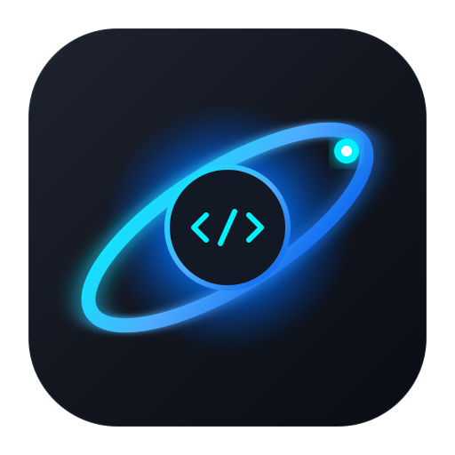

# Orbit

Orbit is a fast, focused, and elegant native code and text editor built with **C++20** and **Qt 6 Widgets** for Linux.

It embraces purposeful minimalism: one project folder, an intuitive file explorer pane, an editor surface with line numbers and smart auto-indentation, and essential file actions—with zero bloat.



---

## Features

- **Split-Pane Architecture**: Smooth resizable horizontal splitter dividing the Explorer sidebar and the Code Editor.
- **Folder Explorer**:
  - Open and browse any project directory.
  - Quiet, clean single-column hierarchy (hides metadata clutter).
  - Clean empty state with quick action to open a folder.
  - Click or double-click to immediately open files.
- **Polished Code Editor**:
  - Dynamic line number gutter with active-line highlight.
  - Current line background highlight.
  - Auto-indentation on `Enter` preserving indentation level (with `{` expansion).
  - Tab converts to 4 spaces, `Shift+Tab` unindents.
  - Smart backspace for 4-space indentation.
  - Zoom in/out via `Ctrl + Plus`/`Ctrl + Minus`/`Ctrl + MouseWheel` or reset with `Ctrl + 0`.
- **File Management & Safety**:
  - Open (`Ctrl+O`), Open Folder (`Ctrl+Shift+O`), Save (`Ctrl+S`), Save As (`Ctrl+Shift+S`), New File (`Ctrl+N`), Close File (`Ctrl+W`).
  - Active file breadcrumb with dirty status dot (`•`).
  - Unsaved change prompt dialog on file switch or application exit to prevent accidental data loss.
  - Pure UTF-8 encoding support.
- **Calm Modern Aesthetics**:
  - Deep slate and charcoal surfaces inspired by GNOME and Deepin.
  - Refined electric blue accents with low-contrast borders.
  - Subdued status bar reporting encoding, line endings, indentation, and live `Ln, Col` cursor position.
  - Remembers window geometry, splitter sizes, and last opened folder across sessions via `QSettings`.
- **Google Antigravity**:
  - Native side panel that installs and runs Google's official Antigravity ACP server (`agy_acp_server`).
  - Same agent harness used by the VS Code, Zed, JetBrains, and Xcode extensions — Orbit cannot load those IDE plugins directly, so it speaks the Agent Client Protocol instead.
  - Sign in with your Google account, chat with the agent, review tool calls, and apply file edits in the open workspace.

---

## Keyboard Shortcuts

| Shortcut | Action |
|---|---|
| `Ctrl + O` | Open File |
| `Ctrl + Shift + O` | Open Project Folder |
| `Ctrl + N` | New Untitled File |
| `Ctrl + S` | Save File |
| `Ctrl + Shift + S` | Save File As |
| `Ctrl + W` | Close File |
| `Ctrl + B` | Toggle Explorer Sidebar |
| `Ctrl + L` | Toggle Antigravity panel |
| `Ctrl + +` / `Ctrl + =` | Zoom In Font |
| `Ctrl + -` | Zoom Out Font |
| `Ctrl + 0` | Reset Zoom |
| `Ctrl + Q` | Quit Orbit |

---

## Google Antigravity

Orbit is a native Qt editor, so it cannot load the official **Visual Studio Code**, **JetBrains**, **Zed**, or **Xcode** plugins. Those extensions are bound to each IDE's own plugin API.

Instead, Orbit uses the same integration path as Zed: Google's official **Antigravity ACP server** (`agy_acp_server`) from the [ACP Registry](https://github.com/agentclientprotocol/registry). That server is the agent backend behind the first-party IDE extensions.

1. Press `Ctrl + L` (or **View → Toggle Antigravity**).
2. Click **Install Antigravity**. Orbit downloads the official binary from Google into `~/.local/share/OrbitEditor/Orbit/antigravity/`.
3. Click **Sign in with Google** if prompted, and complete login in the browser.
4. Use the agent thread like Zed: `@` to mention files, drop images onto the composer, `/` for slash commands, review tool cards and diffs, Keep/Reject edits, Stop a running turn. The open selection is attached automatically. Agent terminals run inside the thread.

You need a Google account with any Antigravity plan, including the free tier. See the [IDE Extensions docs](https://antigravity.google/docs/ide/extensions/) and [CLI install docs](https://antigravity.google/docs/cli/install).

---

## Building from Source

### Prerequisites
- Linux (Arch Linux / CachyOS / Ubuntu / Fedora / Debian)
- C++20 compiler (`g++` or `clang++`)
- Qt 6 Widgets (`qt6-base`)
- CMake 3.21+ (and optionally Ninja)

### Build Commands

```bash
# Configure with CMake
cmake -B build -DCMAKE_BUILD_TYPE=Release

# Compile
cmake --build build -j$(nproc)

# Run Orbit
./build/orbit
```

You can also pass a folder or file directly from the command line:

```bash
./build/orbit /path/to/project
# or
./build/orbit /path/to/file.cpp
```
